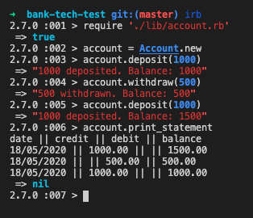

# Bank tech test

This is a small REPL based banking application made in my 10th week at Makers Academy.

This project is intended to demonstrate I can code at a professional level of quality.

You can check out my in depth development journal for this project [here](./development-journal/journal.md).

- [Bank tech test](#bank-tech-test)
  - [Notes](#notes)
  - [Quick Start Guide](#quick-start-guide)
  - [Screen Preview](#screen-preview)
    - [Testing](#testing)
  - [Dependencies](#dependencies)
  - [Specification](#specification)
    - [Requirements](#requirements)
    - [Acceptance Criteria](#acceptance-criteria)
  - [Design](#design)
  - [User Stories](#user-stories)
    - [Domain model](#domain-model)
    - [CRC Cards](#crc-cards)
  - [Set up](#set-up)


## Notes

 - Ruby version 2.7.0
 - 100% Test coverage
 - All tests pass
 - Tests names display in the command line
 - Fully rubocop linted
 - Followed strict TDD

## Quick Start Guide

1. Clone this repository to your local machine.
2. Enter its root folder.
3. Install the ruby dependencies with:
```shell
bundle
```
4. Launch IRB:
```shell
irb
```
Once in IRB:
```shell
> require './lib/account.rb'
> account = Account.new
```
5. Use the following methods with your account:

Methods         | Description
----------------|------------
deposit(amount) |  This method allows you to deposit money into the account. Use a number with up to two decimal places as the parameter.
withdraw(amount) | This method allows you to withdraw money from the account. Use a number with up to two decimal places as the parameter.
print_statement | This method will print your account statement to the console.

You will see something like this in your terminal:

## Screen Preview


### Testing

To run the tests and check everything is working run:
```shell
rspec
```
This will show you test results and code coverage like this:
```shell
Finished in 0.0461 seconds (files took 0.39105 seconds to load)
11 examples, 0 failures


COVERAGE: 100.00% -- 108/108 lines in 2 files
```
You can also check the linting by running:
```shell
rubocop
```
This should return:
```shell
2 files inspected, no offenses detected
```

## Dependencies

This project has no production dependencies, all the dependencies are ruby gems are for testing and development.

Gem | Description
----|----------
rspec | This runs our unit and feature tests
rubocop | This is a ruby code linter.
simplecov | This tests code coverage.
simplecov-console | This displays code coverage in the console.

## Specification

### Requirements

- Runs from IRB.
- Can accept deposits and withdrawals.
- Account statement with date, amount and balance printing.
- Data can be kept in memory (not a database).
  
### Acceptance Criteria

**Given** a client makes a deposit of 1000 on 10-01-2012  
**And** a deposit of 2000 on 13-01-2012  
**And** a withdrawal of 500 on 14-01-2012  
**When** she prints her bank statement  
**Then** she would see

```shell
date || credit || debit || balance
14/01/2012 || || 500.00 || 2500.00
13/01/2012 || 2000.00 || || 3000.00
10/01/2012 || 1000.00 || || 1000.00
```
## Design

## User Stories

- [x] 1

> As a user,  
> So that I can acces banking serviecs,  
> I would like to be able to make an account.

- [x] 2

> As a user,  
> So that I can add money to my account,  
> I would like to be able to add deposits.

- [x] 3

> As a user,  
> So that I can assess my money,  
> I would like to be able to withdraw money from my account.

- [x] 4

> As a user,  
> So that I can see my account history,  
> I would like to be able to print my statement out.

- [x] 5

> As a user,  
> So I can make exact transactions,  
> I would like my program to be able to calculate with pennies

- [x] 6

> As a banker,  
> So that the system is reliable,  
> I would like it to reject false values such as strings and numbers with more than two decimal places.

- [x] 7

> As a banker,  
> So that I don't lose money,  
> I don't want users to be able to go into the negative.

- [x] 8

> As a developer,  
> So the code is easily readable,
> I would like it to be linted.

- [x] 9

> As a developer,  
> So that I know all the code is working,  
> I would like to be able to see test coverage.


### Domain model

Objects | Messages
--------|-------
Account | deposit(amount) <br> withdraw(amount) <br> print_statment <br> @balance <br> @transactions 
Transaction |  @credit <br> @debit <br> @date <br> @balance
Statement | add(transaction) <br> STATEMENT_HEADER <br> @statement_string <br> @transactions

### CRC Cards


Class: Account <br> Responsibilites|   <br> Collaborators
----------------|---------
Knows the balance <br> Know the transactions <br> Accept deposits<br>Accept withdrawals<br>  Print the statement| Transaction <br> Statement

Class: Transaction <br> Responsibilites|   <br> Collaborators
----------------|---------
Knows the debit/credit <br> Know the date <br> Knows the balance | 

Class: Statement <br> Responsibilites|   <br> Collaborators
----------------|---------
Creates a statement  <br> Knows the transactions|

## Set up

I started this project by creating an empty repository on my local machine and github. Then in the local repository, I did the following.
```shell
touch README.md
git init
rspec --init
mkdir lib
```
Then I updated ```.rpsec``` with the following code:
```
--color --format documentation
```
This makes the test names show up in the command line with each test.